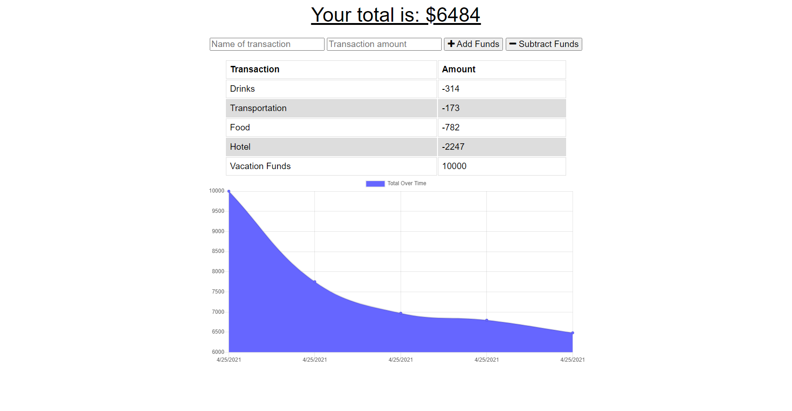

# Budget Tracker Starter Code

This is an app that we created in order to help the user with their budgeting. It allows you to input a name of a transaction (deposit or withdrawal) and also features a graph that gives a visual to the transactions input by the user. The app relies primarily on Node, Express, MongoDB, and IndexDB. 

## Screenshot

## Heroku Link
https://boiling-taiga-76045.herokuapp.com/
